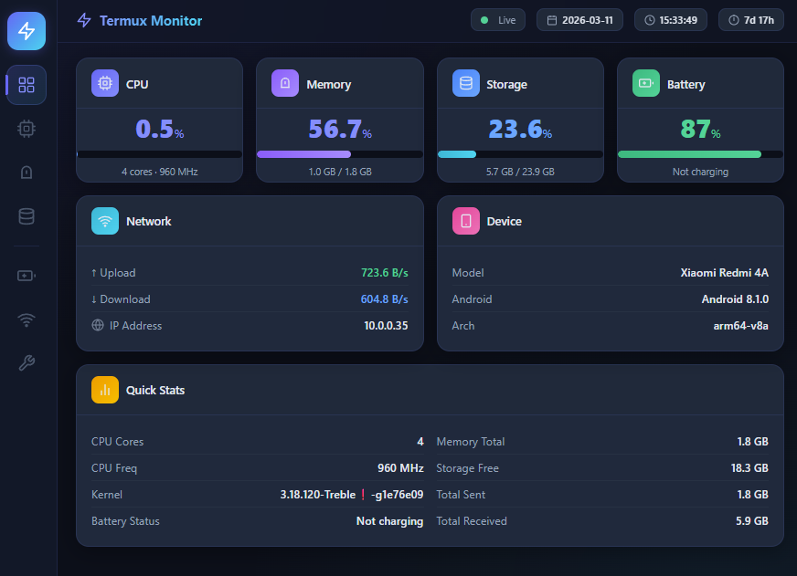
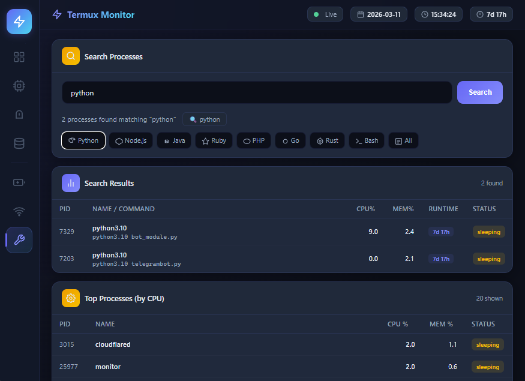

# Termux System Monitor

A modern web-based system dashboard for monitoring your Android device in Termux.  
Built with **Go** — single binary, zero dependencies, runs directly in Termux.

> **Original TUI version (Python):**
> ```bash
> curl -O https://raw.githubusercontent.com/AhmarZaidi/termux-status/main/status.py
> chmod +x status.py
> python status.py
> ```

## Screenshots





## Features

- **Overview** — At-a-glance stat cards for CPU, memory, storage, battery, and network
- **CPU** — Real-time overall & per-core usage, per-core frequencies, and processor model
- **Memory** — RAM and swap usage with buffers/cache breakdown
- **Storage** — Interactive file browser with upload & download support
- **Battery** — Charge percentage, status, health, temperature, current, and time remaining
- **Network** — Real-time upload/download speeds, IPv4/IPv6 addresses, and packet stats
- **Processes** — Search and filter by name, top CPU consumers, auto-refreshed every 1 s
- **Device Info** — Model, manufacturer, Android version, architecture, SDK level, and kernel
- **Custom SVG Icons** — Clean Lucide-inspired icons throughout the UI

## Installation

### Prerequisites

```bash
pkg update && pkg upgrade
pkg install golang
```

### Build from source

```bash
git clone https://github.com/sainz1407/termux-status-web.git
cd termux-status-web
go build -o monitor .
```

The `templates/` directory must remain next to the `monitor` binary when running.

### Cross-compile on desktop (for Linux ARM64 / Termux)

```bash
GOOS=linux GOARCH=arm64 go build -o monitor .
```

Copy both the `monitor` binary and the `templates/` folder to your Termux device.

## Usage

```bash
./monitor
# Custom port
./monitor --port 9090
# Custom bind address
./monitor --host 127.0.0.1 --port 8080
```

Open your browser at `http://localhost:8080` (or the host/port you chose).

| Flag | Default | Description |
|------|---------|-------------|
| `--port` | `8080` | HTTP listen port |
| `--host` | `0.0.0.0` | Bind address |

### File Explorer (Storage tab)

- **Browse** — tap folders to navigate the file system
- **Download** — tap any file to download it to your device
- **Upload** — use the Upload button to send files into the current directory

### Process Manager (Processes tab)

- Search processes by name (e.g. `python`, `node`, `bash`)
- Quick-filter buttons for common runtimes
- Top-10 processes by CPU usage, refreshed every 1 s

## API Endpoints

| Endpoint | Description |
|----------|-------------|
| `GET /` | Serves the dashboard UI |
| `GET /api/status` | Full system snapshot (JSON) |
| `GET /api/browse?path=<dir>` | Directory listing |
| `GET /api/download?path=<file>` | Download a file |
| `POST /api/upload?path=<dir>` | Upload files (multipart) |
| `GET /api/processes?q=<name>` | Search/list processes |
| `GET /api/debug` | Go runtime diagnostics |

## Requirements

- **Android** with [Termux](https://termux.dev) installed
- **Go 1.25+** (only needed to build from source)
- **Termux API** (optional, for battery info): `pkg install termux-api`

## Troubleshooting

**Battery info shows N/A:**
```bash
pkg install termux-api
```

**Permission errors:**  
Some `/proc` files may not be accessible. The monitor handles these gracefully and preserves the last known value.

**Port already in use:**
```bash
./monitor --port 9090
```

**Templates not found:**  
Make sure the `templates/` folder is in the same directory as the `monitor` binary.

## License

MIT License — feel free to use and modify!

## Contributing

Issues and pull requests welcome [here](https://github.com/sainz1407/termux-web/issues)
